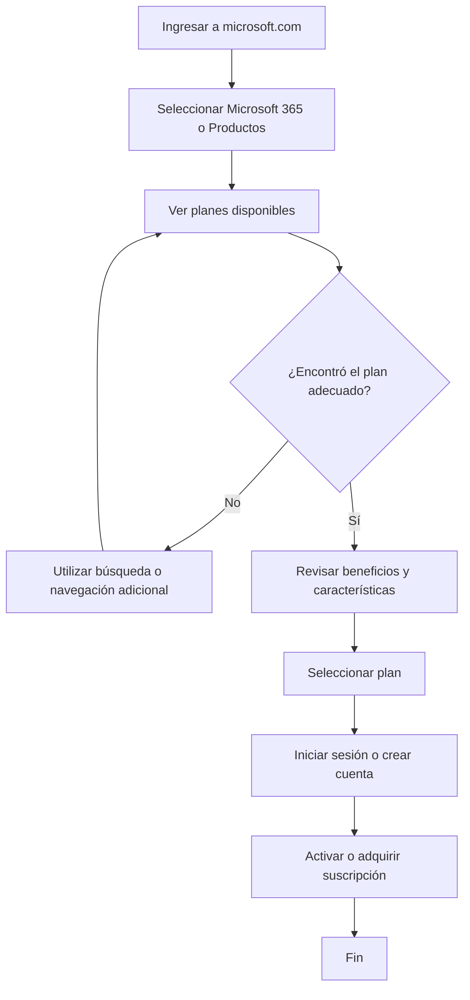

# Evaluación de Usabilidad en Microsoft.com - Tarea 1

## Tarea 1: Evaluación del flujo de activación y compra de licencias
El usuario debe entrar a la sección de inicio de Microsoft.com, localizar los planes comerciales,
contrastar de forma simple los beneficios de la licencia estudiantil frente a la personal, y ubicar
el acceso directo para activar el software con sus credenciales institucionales.
### 1. Diagrama de flujo del proceso

### 2. Perfilado del usuario e interacción en este flujo

La evaluación de este flujo se basó en los dos perfiles de usuario representativos definidos para la plataforma
* **Usuario Principal: El Estudiante Universitario / Joven Profesional**
  * **Experiencia digital:** Media-Alta.
  * **Frecuencia de uso:** Diaria.
  * **Interacción en este flujo:** Busca rápidamente la sección de planes para comparar beneficios de licencias estudiantiles frente a las personales y ubicar la opción de activación directa. Su navegación es dinámica y requiere retroalimentación constante sobre el estado de la cuenta.

* **Usuario Secundario: El Docente Senior / Adulto Mayor**
  * **Experiencia digital:** Básica (presenta resistencia tecnológica moderada).
  * **Interacción en este flujo:** Mantiene una navegación lineal y meticulosa Experimenta fricción cognitiva ante la presencia de nomenclaturas técnicas complejas (como licencias E3, E5 o F3), requiriendo un lenguaje claro para evitar seleccionar una suscripción incorrecta.

---

### 3. Registro de pruebas de usabilidad (Tabla de métricas)

Datos cuantitativos recopilados durante las sesiones de prueba con los participantes en la **Tarea 1: Encontrar información para adquirir o activar una suscripción**
| Participante | Tarea | Completó | Tiempo | Errores cometidos | Requirió ayuda | Grado de satisfacción (1-5) |
| :--- | :---: | :---: | :---: | :---: | :---: | :---: |
| **Viviana** | T1 | Sí | 65 s | 0 | No | 5 / 5 |
| **Alex** | T1 | Sí | 82 s | 1 | No | 4 / 5 |
| **Wilson** | T1 | Sí | 75 s | 0 | No | 5 / 5 |
| **Promedio / Total** | **T1** | **100%** | **74.0 s** | **1 error total** | **No** | **4.67 / 5** |

---

### 4. Observaciones de fricción

* **Desviación accidental hacia Xbox Game Pass:** Se identificó que la página principal (*Home*) presenta saturación visual con anuncios de hardware y entretenimiento. Esto provocó que un participante hiciera clic por error en la sección de Xbox Game Pass pensando que allí encontraría las licencias de software de Microsoft 365, teniéndose que devolver a buscar nuevamente.
* **Complejidad en los nombres de las licencias:** Nomenclaturas técnicas como licencias E3, E5 o F3 generan confusión y dudas en los usuarios al momento de seleccionar la alternativa adecuada para sus necesidades.

### Evaluación Técnica y Herramientas Automáticas

#### Prueba con lector de pantalla NVDA

Se realizó la evaluación mediante el lector de pantalla NVDA para verificar la interpretabilidad de la estructura visual y la navegación asistida:

| Elemento evaluado | Resultado |
| :--- | :--- |
| **Encabezados** | Reconocidos correctamente |
| **Enlaces** | Identificados como enlaces |
| **Botones** | Detectados adecuadamente |
| **Formularios** | Etiquetas anunciadas correctamente |
| **Contenido principal** | Navegable mediante encabezados |

**Hallazgos:** El lector NVDA pudo interpretar la estructura general del sitio sin barreras críticas.

---

### Herramientas Automáticas

#### Evaluación automática de accesibilidad (WAVE)

Se ejecutó la auditoría automatizada con la herramienta WAVE sobre la interfaz pública:

| Indicador | Resultado |
| :--- | :---: |
| **Errores** | 0 |
| **Errores de contraste** | 0 |
| **Alertas** | 5 |
| **Características detectadas** | 17 |
| **Elementos estructurales** | 42 |
| **Elementos ARIA** | 40 |
| **AIM Score** | 9.9 / 10 |

**Hallazgos relevantes:**
* No se detectaron errores críticos de accesibilidad ni problemas de contraste de color.
* Se identificaron 5 alertas que requieren revisión manual.
* WAVE detectó elementos ARIA correctamente implementados para mejorar la accesibilidad.
* Se encontraron textos alternativos extensos y algunas etiquetas de formularios que requieren verificación humana.
* Los resultados muestran un elevado nivel de accesibilidad técnica en la página principal, aunque las alertas identificadas requieren inspección manual por parte del evaluador.

---

#### Evaluación automática mediante Lighthouse

Se corrió la auditoría de rendimiento y accesibilidad con Google Lighthouse en entorno de escritorio emulado:

| Criterio | Puntuación |
| :--- | :---: |
| **Rendimiento** | 75 / 100 |
| **Accesibilidad** | 100 / 100 |
| **Prácticas recomendadas** | 77 / 100 |
| **SEO** | 92 / 100 |
| **Navegación agentica** | 2 / 2 |

**Métricas detalladas de rendimiento:**
* **First Contentful Paint (FCP):** 0,7 s
* **Speed Index:** 2,1 s
* **Total Blocking Time (TBT):** 130 ms
* **Renderizado del mayor elemento con contenido (LCP):** 3,0 s
* **Cambios de diseño acumulados (CLS):** 0,084

**Hallazgos relevantes:**
* Se alcanzó una puntuación perfecta en accesibilidad (100/100).
* El rendimiento general es aceptable (75/100), pero existen oportunidades de optimización en la velocidad de carga del contenido principal (LCP de 3,0 s).
* La puntuación SEO (92/100) evidencia una correcta implementación de prácticas de indexación.