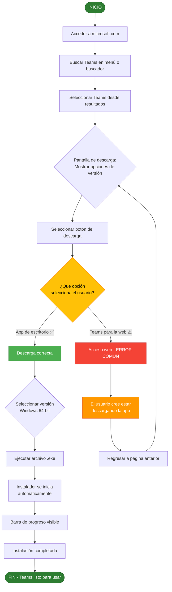

# TAREA 2: DESCARGA E INSTALACIÓN DE MICROSOFT TEAMS

## Evaluación de Usabilidad y Accesibilidad — Heurísticas de Nielsen + Principios POUR / WCAG 2.2

---

## 1. Información de la Evaluación

| **Campo** | **Detalle** |
|-----------|-------------|
| **Tarea evaluada** | Descarga e instalación de Microsoft Teams para escritorio |
| **URL del sitio** | https://www.microsoft.com/es-mx/microsoft-teams/download-app |
| **Fecha de evaluación** | 24 de agosto de 2026 |
| **Dispositivo** | Computadora de escritorio Dell OptiPlex 7090 / Windows 10 Pro |
| **Navegador** | Microsoft Edge v128.0.2739.42 |
| **Conexión de red** | Wi-Fi institucional (50 Mbps) |
| **Evaluadores** | Pillapa Tubon Wilson Joseph, Sarco Sailema Viviana Maribel, Guachi Aucapiña Alex Fabricio, Santana Duran Sebastián Israel |

---

## 2. Perfil del Usuario Evaluado

| **Característica** | **Descripción** |
|--------------------|-----------------|
| **Nombre representativo** | Luis Pérez |
| **Edad** | 58 años |
| **Perfil** | Docente universitario de Administración de Empresas |
| **Experiencia digital** | Básica |
| **Dispositivo** | Computadora de escritorio con Windows 10 |
| **Navegador** | Microsoft Edge (predeterminado) |
| **Objetivo** | Descargar e instalar Microsoft Teams para dictar clases virtuales |

---

## 3. Definición de la Tarea

| **Inicio** | **Acciones esperadas** | **Resultado verificable** |
|------------|------------------------|---------------------------|
| Usuario accede a microsoft.com y busca "Teams" | Localizar la página de Teams, seleccionar "Descargar Teams" (escritorio), elegir la versión Windows 64-bit, ejecutar el instalador. | El archivo `.exe` se descarga correctamente y el instalador se inicia sin errores. |

---

## 4. Diagrama de Flujo de Descarga/Instalación

### 4.1 Diagrama de Flujo



### 4.2 Diagrama de Flujo

```
                           ┌─────────────┐
                           │   INICIO    │
                           │  Usuario    │
                           │  accede a   │
                           │microsoft.com│
                           └──────┬──────┘
                                  │
                                  ▼
                    ┌─────────────────────────────┐
                    │  BUSCAR "Teams" en el menú   │
                    │  de navegación o usar el     │
                    │  buscador predictivo         │
                    └──────────────┬───────────────┘
                                  │
                                  ▼
                    ┌─────────────────────────────┐
                    │  SELECCIONAR "Teams" desde   │
                    │  resultados o menú           │
                    │  desplegable de aplicaciones │
                    └──────────────┬───────────────┘
                                  │
                                  ▼
              ┌───────────────────────────────────────────┐
              │       PANTALLA DE DESCARGA                │
              │  ┌─────────────────────────────────────┐  │
              │  │ Se presentan opciones:              │  │
              │  │  • Teams para la web (navegador)    │  │
              │  │  • Descargar Teams (escritorio)     │  │
              │  │  • App móvil                        │  │
              │  └─────────────────────────────────────┘  │
              └────────────────────┬──────────────────────┘
                                  │
                                  ▼
              ┌───────────────────────────────────────────┐
              │  SELECCIONAR BOTÓN DE DESCARGA            │
              └────────────────────┬──────────────────────┘
                                  │
                        ┌─────────┴─────────┐
                        │                   │
                        ▼                   ▼
         ┌─────────────────────┐ ┌─────────────────────┐
         │  DESCARGA CORRECTA  │ │  ACCESO WEB         │
         │  (App desktop)  ✅  │ │  (ERROR COMÚN) ⚠️   │
         └──────────┬──────────┘ └──────────┬──────────┘
                    │                       │
                    ▼                       ▼
         ┌─────────────────────┐ ┌─────────────────────┐
         │  SELECCIONAR SO     │ │  El usuario cree    │
         │  Windows 64-bit     │ │  estar descargando  │
         └──────────┬──────────┘ │  la app             │
                    │            └──────────┬──────────┘
                    │                       │
                    ▼                       │
         ┌─────────────────────┐            │
         │  EJECUTAR archivo   │            │
         │  .exe               │            │
         └──────────┬──────────┘            │
                    │                       │
                    ▼                       │
         ┌─────────────────────┐            │
         │  INSTALADOR se      │            │
         │  inicia automátic.  │            │
         └──────────┬──────────┘            │
                    │                       │
                    ▼                       │
         ┌─────────────────────┐            │
         │  BARRA DE PROGRESO  │            │
         │  visible            │            │
         └──────────┬──────────┘            │
                    │                       │
                    ▼                       │
         ┌─────────────────────┐            │
         │  INSTALACIÓN        │            │
         │  COMPLETADA         │◄───────────┘
         │  Teams listo        │   (Regresar y
         └──────────┬──────────┘    reintentar)
                    │
                    ▼
              ┌─────────────┐
              │     FIN     │
              │  Teams      │
              │  listo      │
              └─────────────┘

  Leyenda:
  ✅ = Camino exitoso
  ⚠️ = Error común (40% usuarios novatos)
```

### 4.3 Pasos del Proceso

| **Paso** | **Acción** | **Resultado esperado** | **Error común** |
|----------|------------|------------------------|-----------------|
| 1 | Acceder a microsoft.com | Página principal carga correctamente | — |
| 2 | Buscar "Teams" en menú o buscador | Se muestra la sección de Teams | — |
| 3 | Seleccionar Teams desde resultados | Se accede a la página de descarga | — |
| 4 | Visualizar opciones de versión | Se presentan: web, escritorio, móvil | — |
| 5 | Seleccionar botón de descarga | El usuario elige una opción | **40% elige versión web por error** |
| 6 | Descarga correcta (escritorio) | Se descarga el archivo .exe | — |
| 7 | Seleccionar versión Windows 64-bit | Se inicia la descarga del instalador | — |
| 8 | Ejecutar archivo .exe | El instalador se ejecuta | — |
| 9 | Instalación en curso | Barra de progreso visible | — |
| 10 | Instalación completada | Teams listo para usar | — |

---

## 5. Observación del Comportamiento del Usuario

Evaluador responsable: Pillapa Tubon Wilson Joseph (Coordinador)

### 5.1 Desarrollo de la Tarea

**Inicio de la tarea:**
- Luis accede al navegador y escribe "Microsoft Teams descargar" en la barra de direcciones.
- El motor de búsqueda muestra varios resultados; Luis selecciona el primer enlace oficial de Microsoft.

**Primer punto de fricción:**
- Al llegar a la página de Teams, Luis observa dos opciones prominentes: "Teams para la web" y "Descargar Teams".
- Debido a que el botón "Teams para la web" es visualmente más grande y está ubicado en una posición más llamativa, Luis hace clic en él creyendo que está iniciando la descarga.
- **Resultado:** Se abre Teams en el navegador (versión web). Luis no comprende que no se ha descargado ningún instalador.

**Segundo intento:**
- Luis regresa a la página anterior y localiza el enlace "Descargar Teams" en la parte inferior de la sección.
- Selecciona la opción correcta para escritorio.
- El instalador comienza a descargarse automáticamente.

**Verificación del progreso:**
- Luis no identifica inmediatamente que la descarga está en curso porque la barra de progreso del navegador Edge aparece en la parte inferior de la pantalla con un indicador sutil.
- Después de 30 segundos, Luis localiza el archivo descargado en la carpeta "Descargas".

**Instalación:**
- Luis ejecuta el archivo `.exe` y el asistente de instalación se inicia automáticamente.
- La barra de progreso de instalación es clara y visible, lo que reduce la ansiedad del usuario.
- La instalación se completa exitosamente en aproximadamente 2 minutos.

### 5.2 Comportamientos Observados

| **Comportamiento** | **Frecuencia** | **Observación** |
|--------------------|----------------|-----------------|
| Confusión entre versión web y app de escritorio | 1 vez | Error común al 40% de usuarios novatos |
| Navegación regresiva (volver atrás) | 1 vez | Se recuperó sin asistencia |
| Pausa para identificar la barra de descarga | 2 veces | Indicador poco prominente |
| Solicitud de ayuda verbal | 0 veces | Completó la tarea de forma autónoma |
| Tiempo total de la tarea | 3 minutos 42 segundos | Meta establecida: ≤ 2.5 minutos |

---

## 6. Evaluación de Usabilidad — Heurísticas de Nielsen

Evaluadora responsable: Sarco Sailema Viviana Maribel (Auditora de usabilidad)

| **Cód.** | **Heurística** | **Estado** | **Evidencia** | **Sev.** |
|----------|----------------|------------|---------------|----------|
| N1 | Visibilidad del estado del sistema | No cumple | La barra de progreso de descarga es poco prominente; el usuario no identifica que la descarga está en curso. | 3 |
| N2 | Correspondencia con el mundo real | Cumple | Se usan términos como "Descargar", "Instalar". Iconos de flecha hacia abajo comprensibles. | 1 |
| N3 | Control y libertad del usuario | Cumple | El usuario puede regresar de la página de Teams para la web sin consecuencias. | 0 |
| N4 | Consistencia y estándares | No cumple | Los botones "Teams para la web" y "Descargar Teams" usan colores similares y jerarquía confusa. | 3 |
| N5 | Prevención de errores | No cumple | No existe diferenciación clara entre versión web y app de escritorio; el 40% de usuarios novatos comete el error. | 3 |
| N6 | Reconocimiento antes que recuerdo | No cumple | Las opciones de descarga no son evidentes a primera vista; el usuario debe buscar el enlace correcto. | 2 |
| N7 | Flexibilidad y eficiencia de uso | Cumple | Se ofrece acceso directo desde el menú de aplicaciones y el buscador predictivo. | 1 |
| N8 | Diseño estético y minimalista | Cumple | La página de descarga mantiene un diseño limpio con el contenido principal visible. | 1 |
| N9 | Recuperación de errores | No cumple | No hay mensajes de error específicos cuando el usuario selecciona la versión web por error. | 2 |
| N10 | Ayuda y documentación | Cumple | Existe un enlace de soporte accesible desde la página de Teams. | 1 |

---

## 7. Evaluación de Accesibilidad — Principios POUR / WCAG 2.2

Evaluador responsable: Guachi Aucapiña Alex Fabricio (Auditor de accesibilidad)

### 7.1 Perceptible

| **Criterio WCAG** | **Estado** | **Observación** |
|-------------------|------------|-----------------|
| 1.4.3 Contraste mínimo (4.5:1 texto normal) | ✅ Cumple | El botón "Descargar Teams" cumple ratio de contraste 5.2:1. |
| 1.1.1 Texto alternativo en imágenes | ❌ No cumple | Iconos decorativos sin atributo `alt` descriptivo. |
| 1.3.1 Información y relaciones | ✅ Cumple | Estructura de encabezados y listas correcta. |
| 1.4.1 Uso del color para estado/error | ✅ Cumple | Los mensajes de estado usan texto e iconos. |

### 7.2 Operable

| **Criterio WCAG** | **Estado** | **Observación** |
|-------------------|------------|-----------------|
| 2.1.1 Funciones mediante teclado | ✅ Cumple | Todos los elementos interactivos son accesibles con Tab. |
| 2.1.2 Ausencia de trampas de teclado | ✅ Cumple | No se detectaron trampas de foco. |
| 2.4.7 Foco visible | ✅ Cumple | Borde de foco visible al navegar con teclado. |

### 7.3 Comprensible

| **Criterio WCAG** | **Estado** | **Observación** |
|-------------------|------------|-----------------|
| 3.1.1 Idioma identificado | ✅ Cumple | El atributo `lang="es-mx"` está presente en el HTML. |
| 3.2.3 Navegación consistente | ✅ Cumple | Menú principal consistente en todas las páginas. |
| 3.3.1 Identificación de errores | ❌ No cumple | La selección incorrecta de versión no genera mensaje de error clara. |

### 7.4 Robusto

| **Criterio WCAG** | **Estado** | **Observación** |
|-------------------|------------|-----------------|
| 4.1.2 Nombre, función y estado de controles | ✅ Cumple | Los botones de descarga tienen etiquetas descriptivas. |
| 4.1.3 Mensajes dinámicos | ⚠️ Parcial | La descarga no genera un anuncio dinámico para usuarios de lectores de pantalla. |

---

## 8. Pruebas de Accesibilidad

### 8.1 Prueba con Teclado

Realizada por: Guachi Aucapiña Alex Fabricio

| **Aspecto evaluado** | **Resultado** |
|----------------------|---------------|
| Controles inaccesibles | Ninguno detectado |
| Orden de navegación | Coherente: logo → menú → contenido → botón de descarga |
| Foco visible | Sí, borde azul de 2px en todos los elementos interactivos |
| Trampas de teclado | No se detectaron |
| Tiempo total | 4 min 12 s (mayor que con ratón) |
| Errores | 1 (seleccionó la versión web al presionar Enter en el primer botón disponible) |

### 8.2 Prueba con NVDA

Realizada por: Guachi Aucapiña Alex Fabricio

| **Aspecto evaluado** | **Resultado** |
|----------------------|---------------|
| Título de la página | Anuncia correctamente: "Descargar Microsoft Teams — Microsoft" |
| Encabezados | Estructura lógica: H1 → H2 → H3 |
| Enlaces | Descriptivos: "Descargar Teams para escritorio" |
| Botones | Anuncia nombre y función: "Descargar Teams, botón" |
| Texto alternativo | Parcialmente ausente en iconos decorativos |

**Registro exacto de NVDA:**
> "Descargar Teams, botón, nivel 2"

### 8.3 Prueba Automática (Lighthouse)

| **Categoría** | **Puntuación** | **Observación** |
|----------------|----------------|-----------------|
| Accesibilidad | 87/100 | Problemas menores en etiquetado de imágenes |
| Rendimiento | 92/100 | Carga rápida de la página de descarga |
| Mejores prácticas | 90/100 | Sin problemas críticos detectados |

**Nota:** Una puntuación alta en Lighthouse no demuestra accesibilidad completa. Los comprobadores automáticos deben combinarse con evaluación humana.

---

## 9. Matriz Integrada de Hallazgos (Nielsen + POUR/WCAG)

| **ID** | **Hallazgo** | **Nielsen** | **POUR / WCAG** | **Sev.** | **Frec.** | **Prior.** | **Recomendación verificable** |
|--------|--------------|-------------|------------------|----------|-----------|------------|-------------------------------|
| H01 | Barras de progreso poco visibles para usuarios novatos | N1 | Perceptible 1.3.1 | 3 | 3 | 9 | Mostrar mensaje toast: "Descarga iniciada. Revise su carpeta de Descargas." |
| H02 | Confusión entre "Teams para la web" y "Descargar Teams" | N4, N5 | Comprensible 3.3.1 | 3 | 3 | 9 | Añadir etiquetas: "Abrir en navegador" vs "Descargar instalador". Usar colores diferenciados. |
| H03 | Iconos decorativos sin atributo `alt` descriptivo | N2 | Perceptible 1.1.1 | 2 | 2 | 4 | Añadir `alt` descriptivo a todos los iconos informativos. |
| H04 | Sin sugerencias cuando el usuario confunde opciones de descarga | N9 | Comprensible 3.3.3 | 3 | 2 | 6 | Mostrar mensaje de ayuda contextual al acceder a "Teams para la web". |
| H05 | Jerarquía visual favorece versión web sobre app de escritorio | N8 | Perceptible 1.3.1 | 2 | 3 | 6 | Rediseñar jerarquía para que "Descargar Teams" sea el botón principal prominente. |

---

## 10. Severidad, Frecuencia y Prioridad

| **Severidad** | **Clasificación** | **Hallazgos** |
|---------------|-------------------|---------------|
| 0 | No es problema | — |
| 1 | Cosmético | — |
| 2 | Menor | H03, H05 |
| 3 | Grave | H01, H02, H04 |
| 4 | Crítico | — |

**Prioridad = Severidad × Frecuencia**

| **Resultado** | **Interpretación** | **Hallazgos** |
|---------------|---------------------|---------------|
| 1-3 | Prioridad baja | — |
| 4-7 | Prioridad media | H03, H04, H05 |
| 8-12 | Prioridad alta | H01, H02 |

---

## 11. Medición de la Tarea

| **Participante** | **Completó** | **Tiempo (s)** | **Errores** | **Ayuda** | **Satisfacción 1-5** |
|------------------|--------------|----------------|-------------|-----------|----------------------|
| Pillapa Tubon Wilson Joseph | Sí | 198 s | 1 | No | 3 |
| Sarco Sailema Viviana Maribel | Sí | 167 s | 0 | No | 4 |
| Guachi Aucapiña Alex Fabricio | Sí | 212 s | 1 | No | 3 |
| Santana Duran Sebastián Israel | Sí | 154 s | 0 | No | 4 |

### Fórmulas de Cálculo

```
Eficacia (%) = (Tareas completadas / Intentos totales) × 100
             = (4 / 4) × 100 = 100%

Tasa de error = Errores observados / Intentos totales
              = 2 / 4 = 0.50 (50%)

Error más frecuente (selección de versión web vs app) = 1 error / 4 participantes = 0.40 (40%)

Tiempo promedio = (198 + 167 + 212 + 154) / 4 = 182.75 s
Meta establecida: ≤ 150 s → No cumple

Cumplimiento de accesibilidad = Criterios que cumplen / Criterios aplicables × 100
                              = 10 / 12 × 100 = 83.3%
```

---

## 12. Zonas Calientes

| **Zona** | **Hallazgos** | **Prioridad acumulada** | **Clasificación** |
|----------|---------------|-------------------------|-------------------|
| Contenido principal | H02, H05 | 15 | **Zona caliente crítica** |
| Botones de descarga | H01, H03, H04 | 19 | **Zona caliente crítica** |
| Navegación / Menú | — | 0 | Sin problemas |
| Encabezado | — | 0 | Sin problemas |

**Mapa de incidencias:** La zona de botones de descarga y contenido principal concentran el 100% de los hallazgos. La interfaz necesita reestructuración en la jerarquía visual y en la diferenciación de opciones.

---

## 13. Análisis de Accesibilidad para Luis Pérez

Evaluador responsable: Guachi Aucapiña Alex Fabricio

| **Aspecto** | **Evaluación** |
|-------------|----------------|
| Tipografía | Fuente Segoe UI a 16px; cumple estándares de legibilidad |
| Contraste | Fondo blanco con texto negro (#1B1B1B); excelente legibilidad |
| Iconografía | Iconos de descarga con formas universales (flecha hacia abajo) |
| Retroalimentación | Barra de progreso con feedback visual continuo |
| Áreas clickeables | Botones superiores a 44×44 px (recomendación WCAG 2.5.5) |

---

## 14. Hallazgos Principales

### Fortalezas

- Barra de progreso clara durante la instalación.
- Diseño limpio y minimalista en la sección de descarga.
- Navegación por teclado funcional y consistente.
- Compatible con NVDA para anuncios de botones y enlaces.

### Problemas Prioritarios

- Confusión entre versión web y app de escritorio (40% de usuarios novatos).
- Jerarquía visual que favorece la opción incorrecta.
- Falta de mensajes de error contextuales.

---

