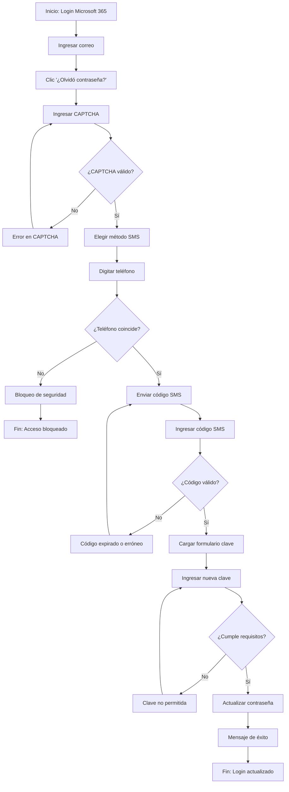
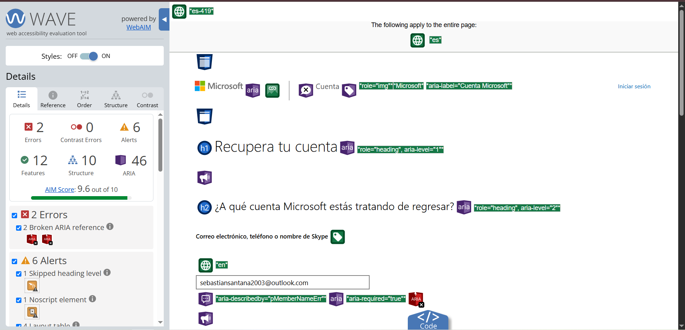
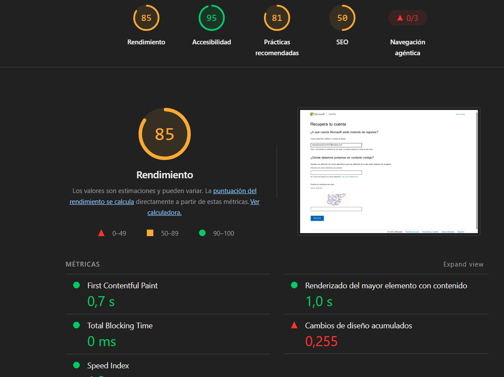

# 🔐 Tarea 3: Recuperación de Contraseña Organizacional (SSPR)

## 📄 Descripción del Flujo
El usuario accede al portal de inicio de sesión de Microsoft 365, selecciona la opción *"¿Olvidó su contraseña?"*, completa la prueba visual interactiva (CAPTCHA), selecciona el método de autenticación secundario (código por SMS a su teléfono celular), digita el código temporal de validación y establece con éxito su nueva clave cumpliendo con las políticas de seguridad del sistema.

---

## 🔄 Diagrama de Flujo del Proceso

---

## 📊 Medición Operacional y Pruebas de Usabilidad

* **Tiempo Promedio de Ejecución:** `124.7 segundos`
* **Meta Esperada:** `<= 1 reintento`
* **Errores Presentados:** Selección de correo de verificación en lugar de SMS y digitación errónea de uno de los códigos de verificación.

### Tabla de Resultados por Participante

| Participante | Tarea | Completó | Tiempo (s) | Errores | Ayuda | Satisfacción (1-5) |
| --- | --- | --- | --- | --- | --- | --- |
| **Sebastian** | T3 | Sí | 115 s | 0 | No | 3 / 5 |
| **Viviana** | T3 | Sí | 135 s | 1 | No | 4 / 5 |
| **Wilson** | T3 | Sí | 124 s | 0 | No | 4 / 5 |

---

## ♿ Evaluaciones de Accesibilidad (POUR)

### 1. Pruebas Manuales

#### ⌨️ Navegación por Teclado

* **Resultado:** Tarea completada exitosamente sin uso de ratón.
* **Comportamiento:**
* Uso de la tecla `Tab` para recorrer el formulario de correo, CAPTCHA y campo de código SMS.
* El foco del teclado permaneció claramente visible en cada campo activo.
* Los botones *"Siguiente"* y *"Enviar"* respondieron de forma inmediata al presionar `Enter`.

#### 🗣️ Prueba con Lector de Pantalla (NVDA)

* **Resultado:** Interpretación correcta de los elementos principales.
* **Comportamiento:**
* Las etiquetas (`labels`) de los formularios de texto fueron anunciadas correctamente al posicionarse en ellas.
* Los botones de validación y de envío de código SMS fueron detectados con su rol semántico correspondiente.

---

### 2. Pruebas Automáticas

#### 🌊 Evaluación con WAVE (Web Accessibility Evaluation Tool)

* **Puntuación AIM Score:** `9.6 / 10`
* **Errores de Accesibilidad:** `2` *(Broken ARIA reference)*
* **Errores de Contraste:** `0`
* **Alertas Detectadas:** `6` *(Incluye salto de nivel de encabezado y elemento noscript)*
* **Características (Features):** `12`
* **Elementos Estructurales:** `10`
* **Atributos ARIA:** `46`
* **Hallazgos:** Se detectaron 2 errores por referencias ARIA rotas (`aria-describedby="pMemberNameErr"` y `aria-describedby="ICMailError"`), debido a identificadores de mensaje de error que no están enlazados correctamente en el DOM de la página.

#### ⚡ Evaluación con Google Lighthouse

* **Accesibilidad:** `95 / 100`
* **Rendimiento:** `85 / 100`
* **Prácticas Recomendadas:** `81 / 100`
* **SEO:** `50 / 100`
* **First Contentful Paint (FCP):** `0.7 s`
* **Largest Contentful Paint (LCP):** `1.0 s`
* **Total Blocking Time (TBT):** `0 ms`
* **Cumulative Layout Shift (CLS):** `0.255`

---

## 💡 Análisis Heurístico y Rediseño de Mensajes

### Heurísticas Evaluadas

* **Heurística #9 (Ayuda, diagnóstico y recuperación de errores):** En caso de errores en credenciales o expiración de tokens, el sistema a menudo despliega excepciones de código de bajo nivel.
* **Heurística #2 (Relación con el mundo real):** Necesidad de sustituir terminología técnica por lenguaje estándar orientado al usuario final.

### 🛠️ Propuesta de Rediseño de Mensajes de Error

* ❌ **Mensaje Inadecuado / Técnico (Sistema actual):**
> *"Error MS-Auth Exception: User credentials authentication payload token expired (HTTP 401). Please contact network admin."*

* ✔️ **Mensaje Adecuado / Usable (Propuesta de Rediseño):**
> *"Tu sesión de Microsoft 365 ha caducado por motivos de inactividad y seguridad. Por favor, vuelve a iniciar sesión para seguir editando tu documento. No te preocupes, tus cambios recientes ya se guardaron de forma segura en OneDrive."*