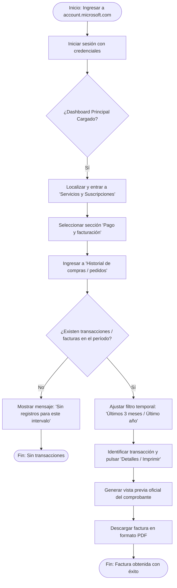

# Documentación de Tarea 4: Historial de Facturación y Compras (Integral y Completa)

## Tarea 4: Consulta y Descarga del Historial de Facturación y Compras

### 1. Diagrama de Flujo de Navegación y Ruta Crítica

El siguiente flujo describe paso a paso la interacción que realiza el usuario desde el acceso al portal de cuenta unificada de Microsoft (`account.microsoft.com`) hasta la consulta y descarga local de su factura oficial en formato PDF:

---

### 2. Registro Cuantitativo de Tiempos y Análisis de Errores Operacionales

Esta tarea representó el flujo con **mayor tiempo de ejecución de toda la evaluación** (promedio de **150.7 segundos** frente a los 74.0s de T1 o 88.3s de T2) y acumuló una tasa de error del 66.7% (2 errores en 3 participantes).

#### Métricas Cuantitativas (ISO 9241-11)

| Indicador / Métrica | Meta Establecida | Resultado Obtenido | Evaluación |
| :--- | :---: | :---: | :---: |
| **Eficacia** | 85.0% | **100% (3/3 completaron)** | Superada |
| **Eficiencia** | 240.0 s (4 min) | **150.7 s (Tarea más lenta)** | Requiere optimización |
| **Tasa de Error Operacional** | 20.0% | **66.7% (2 errores / 3 intentos)** | Alta fricción |
| **Satisfacción Subjetiva** | 4.0 | **4.0 / 5** | Aceptable |

#### Registro Detallado por Participante

| Participante | Estado | Tiempo (s) | Errores Operacionales | Asistencia Externa | Calificación Satisfacción (1-5) |
| :--- | :---: | :---: | :---: | :---: | :---: |
| **Alex** | Completado | 145.0 s | 1 error | No requerida | 4 / 5 |
| **Viviana** | Completado | 158.0 s | 1 error | No requerida | 4 / 5 |
| **Sebastian** | Completado | 149.0 s | 0 errores | No requerida | 4 / 5 |
| **Promedio / Consolidado** | **100% Éxito** | **150.7 s** | **2 errores totales** | **0 solicitudes** | **4.0 / 5** |

#### Causa Raíz de los Errores Detectados

- **Confusión semántica en la arquitectura de información:** Los participantes (Alex y Viviana) ingresaron inicialmente al apartado de "Suscripciones" asumiendo que desde allí se consultaban y descargaban los recibos y pagos, teniendo que retroceder al percatarse de que el historial tributario y de compras se encontraba bajo "Pago y facturación".
- **Fricción por filtro cronológico por defecto:** La vista inicial limita las transacciones a los últimos 3 meses, provocando confusión visual momentánea hasta ubicar el filtro desplegable para seleccionar "Último año".

---

### 3. Hallazgos Heurísticos y Usabilidad en el Panel Unificado

A partir del análisis heurístico de Jakob Nielsen y la matriz POUR:

1. **Relación entre el sistema y el mundo real (Heurística #2 - Severidad 2):**
   El modelo mental del usuario asocia una suscripción activa con su respectivo pago/factura. La separación modular estricta entre "Suscripciones" y "Pago y facturación" rompe esta expectativa y genera desvíos en la navegación.

2. **Flexibilidad y eficiencia de uso (Heurística #7 - Severidad 2):**
   La profundidad excesiva de navegación (6 niveles de clics hasta el PDF) penaliza el tiempo de los usuarios que solo buscan descargar un comprobante periódico.

3. **Reconocer antes que recordar (Heurística #6 - Severidad 1):**
   La acción de descargar el comprobante en PDF está oculta dentro de una vista desplegable secundaria en cada orden, obligando al usuario a memorizar el procedimiento en lugar de tener un botón visible de descarga rápida.

---

### 4. Evaluación de Accesibilidad (Técnica y Pruebas Asistivas)

Para verificar el cumplimiento de los principios de accesibilidad universal (**POUR** - Perceptible, Operable, Comprensible y Robusto), se aplicaron tanto pruebas manuales asistidas como auditorías con herramientas automáticas.

#### 4.1. Pruebas de Navegación por Teclado y Lector de Pantalla (NVDA)

**Navegación mediante Teclado (`Tab` / `Enter`):**
- Toda la secuencia hacia el historial de facturación es completamente navegable sin uso del ratón.
- El indicador de foco (`focus visible`) se mantiene claro y visible al tabular entre los enlaces de servicios, menús desplegables de fechas y botones de acción.

**Prueba con Lector de Pantalla (NVDA):**
- Los encabezados (`H1`, `H2`, `H3`) de las secciones de cuenta y facturación son reconocidos jerárquicamente en orden lógico.
- Las tablas de transacciones y los enlaces de descarga de documentos están correctamente etiquetados semánticamente, permitiendo que el software anuncie con claridad el estado de la compra y la acción de descarga del comprobante.

#### 4.2. Auditorías con Herramientas Automáticas

| Herramienta | Métrica / Indicador | Resultado Obtenido | Diagnóstico y Hallazgos |
| :--- | :--- | :---: | :--- |
| **WAVE (Web Accessibility Evaluation Tool)** | Errores de Accesibilidad | **0** | No se detectaron errores críticos de accesibilidad ni fallos de contraste. |
| | Errores de Contraste | **0** | |
| | Alertas | **5** | Las 5 alertas corresponden a textos alternativos extensos que no bloquean la interacción. |
| | Elementos ARIA | **40** | 40 atributos ARIA garantizan la interpretación de menús y diálogos dinámicos. |
| | AIM Score | **9.9 / 10** | |
| **Google Lighthouse** | Accesibilidad | **100 / 100** | Puntaje perfecto en accesibilidad, validando la estructura DOM y etiquetado estándar. |
| | SEO | **92 / 100** | |
| | Prácticas Recomendadas | **77 / 100** | |
| | Rendimiento General | **75 / 100** | Rendimiento aceptable con carga inicial rápida, aunque con margen de optimización en el renderizado de tablas pesadas. |
| | First Contentful Paint (FCP) | **0.7 s** | |
| | Total Blocking Time (TBT) | **130 ms** | |

---

### 5. Propuestas de Rediseño y Optimización

| Componente / Módulo | Problema Identificado | Propuesta de Rediseño | Impacto Esperado |
| :--- | :--- | :--- | :--- |
| **Interconexión Modular** | Separación rígida entre suscripciones activas y facturas. | Incorporar el botón directo "Ver recibos / Descargar última factura" dentro de la tarjeta de la suscripción. | Reducción de ~30s en navegación y eliminación del error de retroceso. |
| **Filtros Temporales** | Selector de fechas poco evidente; muestra solo 3 meses. | Integrar chips de filtro rápido ("Últimos 3 meses", "Último año", "Histórico completo") en la cabecera. | Evitar pantallas aparentemente vacías y desorientación del usuario. |
| **Exportación PDF** | Acción de descarga oculta en el submenú de cada orden. | Agregar un icono directo de descarga rápida (PDF) en la columna de estado de cada pedido. | Reducción de clics de 6 a 3 para la obtención del comprobante. |