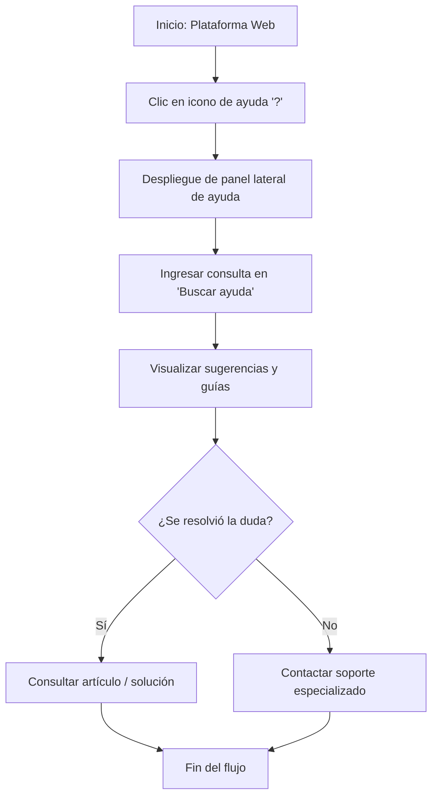
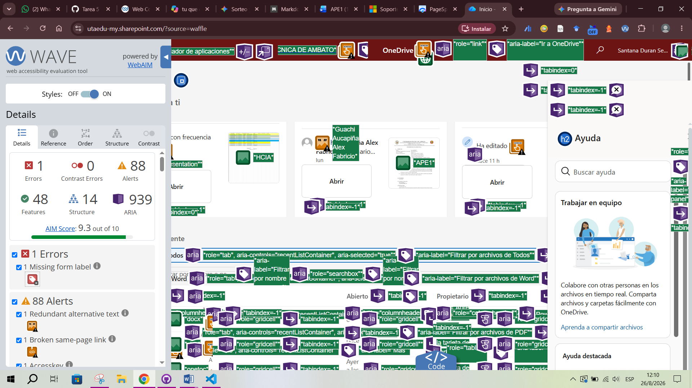

# 🎧 Tarea 5: Localización del Centro de Soporte y Ayuda Interactiva

## 📄 Descripción del Flujo
El usuario accede a la plataforma web de trabajo, despliega el panel lateral interactivo mediante el icono de ayuda (`?`), utiliza la barra de búsqueda contextual (*"Buscar ayuda"*) para ingresar palabras clave de su problema y consulta los artículos de soporte o guías destacadas para resolver su inquietud.

---

## 🔄 Diagrama de Flujo del Proceso

---

## 📊 Medición Operacional y Pruebas de Usabilidad

* **Tiempo Promedio de Ejecución:** `80.0 segundos`
* **Meta Esperada:** Abrir el panel de ayuda y realizar una búsqueda directa en menos de 90 segundos.
* **Fricción Registrada:** Densidad de elementos interactivos y controles ARIA dentro del panel de ayuda en pantallas de alta resolución.

### Tabla de Resultados por Participante

| Participante | Tarea | Completó | Tiempo (s) | Errores | Ayuda | Satisfacción (1-5) |
| --- | --- | --- | --- | --- | --- | --- |
| **Sebastian** | T5 | Sí | 75 s | 0 | No | 4 / 5 |
| **Viviana** | T5 | Sí | 88 s | 1 | No | 4 / 5 |
| **Alex** | T5 | Sí | 77 s | 0 | No | 5 / 5 |

---

## ♿ Evaluaciones de Accesibilidad (POUR)

### 1. Pruebas Manuales

#### ⌨️ Navegación por Teclado

* **Resultado:** Satisfactorio con foco visible.
* **Comportamiento:**
* Activación inmediata del panel lateral con la tecla `Enter` tras posicionar el foco en el botón de ayuda (`?`).
* Desplazamiento mediante `Tab` directo al campo de texto *"Buscar ayuda"* y navegación fluida entre los módulos de tarjetas interactivas.

#### 🗣️ Prueba con Lector de Pantalla (NVDA)

* **Resultado:** Lectura estructurada del panel de ayuda.
* **Comportamiento:**
* NVDA anuncia correctamente el encabezado principal del panel (`<h2> Ayuda`).
* Identificación adecuada del campo de búsqueda (`searchbox`) y los botones de acción contextuales.

---

### 2. Pruebas Automáticas

#### 🌊 Evaluación con WAVE (Web Accessibility Evaluation Tool)

* **Puntuación AIM Score:** `9.3 out of 10`
* **Errores de Accesibilidad:** `1` *(Missing form label en campo de filtro interno)*
* **Errores de Contraste:** `0`
* **Alertas Detectadas:** `88` *(Etiquetas alt redundantes y enlaces de ayuda internos duplicados)*
* **Características (Features):** `48`
* **Elementos Estructurales:** `14`
* **Atributos ARIA:** `939` *(Uso intensivo de marcado semántico accesible en widgets del panel de soporte)*

---

> ⚠️ **Nota Técnica: Justificación de la Exclusión de Auditoría Google Lighthouse**
> La prueba automatizada de **Google Lighthouse** para la pantalla de ayuda interactiva fue **excluida del informe** debido a la siguiente limitación técnica:
> * **Redirección por Falta de Sesión (SSO):** Al ejecutar la herramienta Lighthouse en un entorno headless/remoto, la herramienta no conserva las credenciales ni las cookies de sesión activa del usuario.
> * Esto provocó que el servidor Microsoft redirigiera la auditoría automáticamente hacia la **pantalla pública de inicio de sesión institucional (`login.microsoftonline.com`)**, evaluando la interfaz de login de la universidad en lugar del panel de soporte.
> 
> 
> Para no adulterar el análisis con métricas de una pantalla ajena al flujo, la evaluación de accesibilidad de esta tarea se sustenta con los datos de **WAVE** (ejecutado directamente sobre la sesión autenticada) y las **pruebas manuales de navegación por teclado y lector NVDA**.

## 💡 Análisis Heurístico y Conclusión

### Heurísticas Evaluadas

* **Heurística #10 (Ayuda y documentación):** Excelente desempeño. Proporciona asistencia interactiva directamente en la pantalla de trabajo del usuario, eliminando la necesidad de abandonar el flujo principal para resolver inquietudes.
* **Heurística #1 (Visibilidad del estado del sistema):** El asistente indica claramente si la búsqueda está procesando resultados o cargando tutoriales sugeridos.

El panel de soporte interactivo ofrece una gran robustez semántica en términos de accesibilidad, evidenciada por sus 939 atributos ARIA y un AIM Score de 9.3/10 en WAVE. A pesar de la restricción técnica para auditar el entorno con Google Lighthouse por cuestiones de autenticación SSO, las verificaciones manuales con lector de pantalla NVDA y teclado confirman que la interfaz es altamente usable, accesible e intuitiva para los usuarios.